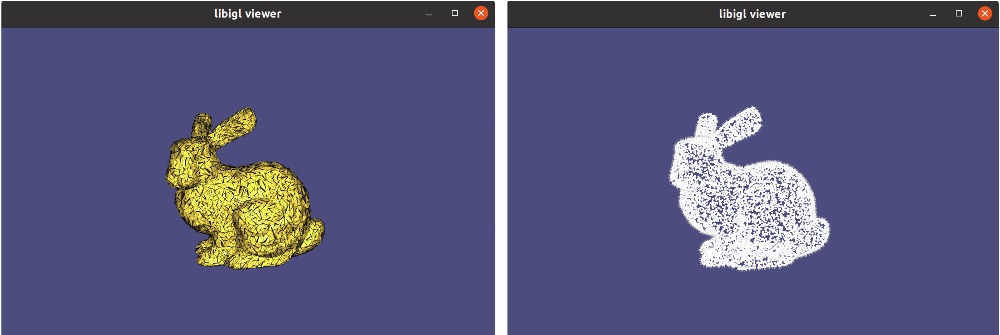
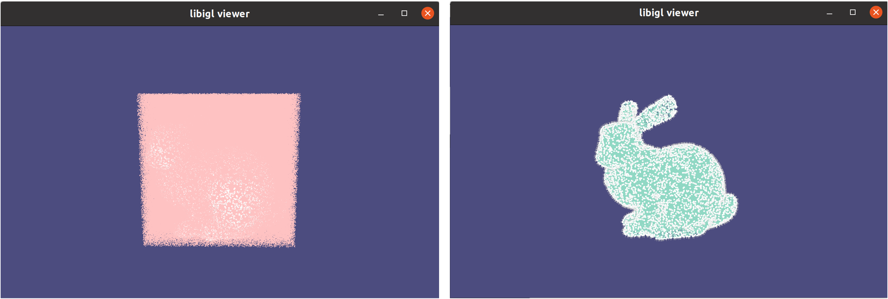
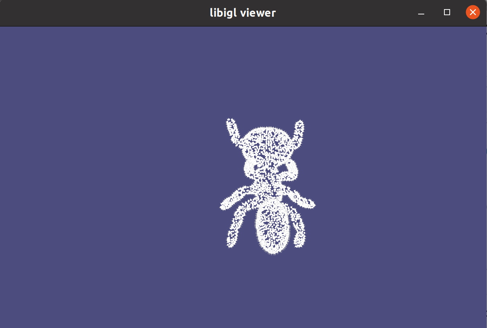
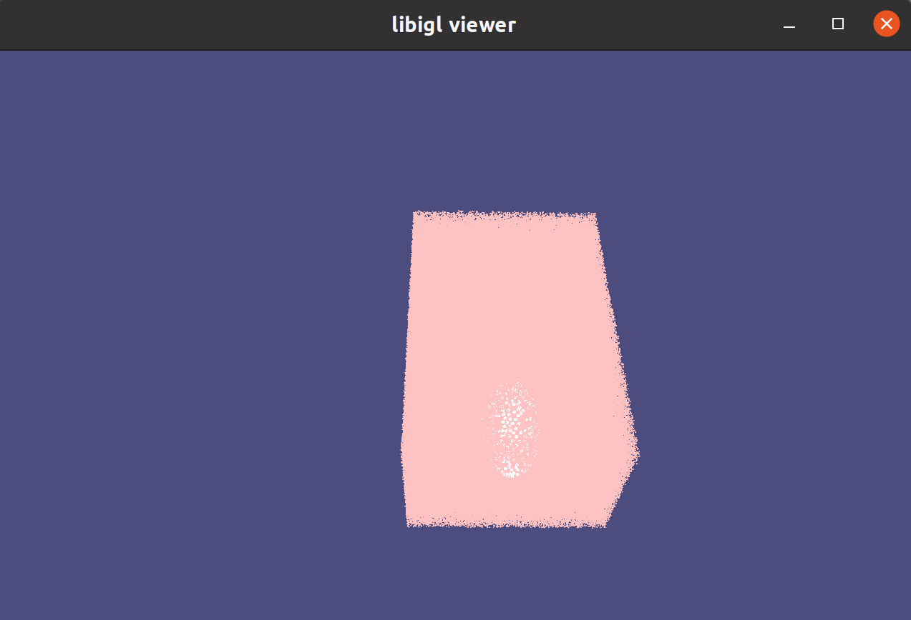
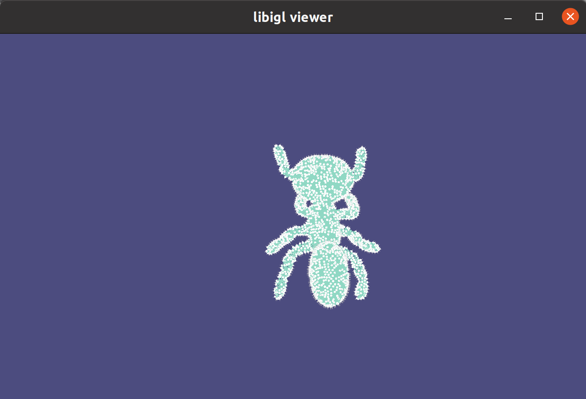

# Introduction

Fast Winding Number Field for Coverage Axis and Coverage Axis++.
https://github.com/Frank-ZY-Dou/Coverage_Axis

More instructions: https://github.com/Frank-ZY-Dou/Coverage_Axis#point-cloud-input

This repo will give two programs.

### FastWindingNumber
You will find an executable file `807_FastWindingNumber` in the folder `bin`. This is a tutorial program.  
You can run it by
```commandline
./807_FastWindingNumber
```
Press "1" twice to toggle between viewing the polygon soup and the point cloud.
<p align="center">

</p>
Press "2" twice to toggle between viewing the full query point cloud and the point cloud identified within the volume—these are the inside candidates we need.
<p align="center">

</p>

### FastWindingNumber_CA
This is our case. Please remember to put the [01Ants-12_mesh_ori_pc.obj](input/01Ants-12_mesh_ori_pc.obj) in to the bin folder too.

```commandline
./807_FastWindingNumber_CA ./01Ants-12_mesh_ori_pc.obj  ./01Ants-12_mesh_inner_points.obj
```
Visulization:
Press "1" to view the point cloud.
<p align="center">

</p>

Press "2" twice to toggle between viewing the full query point cloud and the point cloud identified within the volume—these are the inside candidates we need.
<p align="center">

</p>
<p align="center">

</p>


# libigl - A simple C++ geometry processing library

[](https://github.com/libigl/libigl/actions?query=workflow%3ABuild+branch%3Amain+event%3Apush)
[](https://anaconda.org/conda-forge/igl)


Documentation, tutorial, and instructions at <https://libigl.github.io>.


| 🆕 Doxygen Documentation |
|:---|
| The latest version of libigl (v2.5.0) introduces [doxygen generated detailed documentation](https://libigl.github.io/dox/index.html) |
